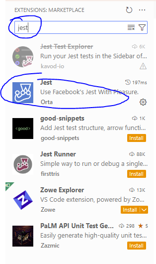
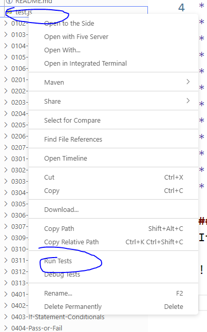

# JavaScript Practices
We highly suggest that you try this out on Gitpod or Github CodeSpace, unless you are familiar with Git and Visual Studio Code.

The JavaScript Practices are topical in nature. The first two numbers of a folder indicate which topic it belongs:

* 01 - Variables
* 02 - Operators and Math
* 03 - Input
* 04 - If/else
* 05 - Loops
* 06 - Advanced Loops
* 07 - String manipulation
* 08 - Arrays
* 09 - Iterators (optional)
* 10 and 11 - advanced functions
* 12 - Custom Functions
* 13 - OOP (optional)

## To run the automated tests
If you wish to use automated testing, please install the `Jest` extension in Visual Studio Code. (Type Jest into the search bar).

After which, open the terminal at the project folder and type in `npm install` and press [ENTER].

Then right click on the `test.js` in the folder, and select [Run Test].

You will see if the test is successful or not.